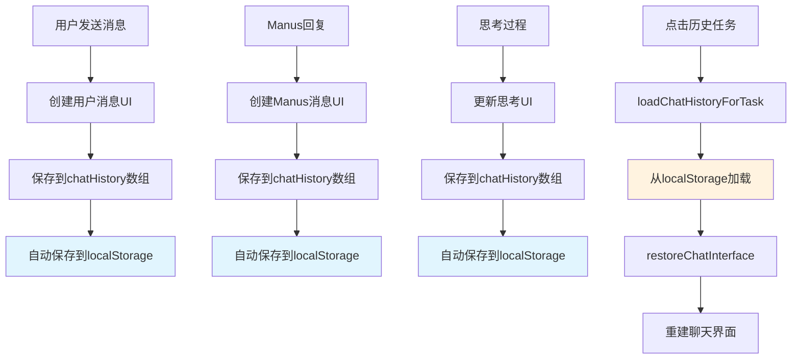

# 功能扩展优化报告

## 🎯 扩展目标

根据用户需求，完成了以下两个关键功能扩展：

1. ✅ **聊天历史持久化** - 保存和恢复任务交互历史
2. ✅ **新标签页新建任务** - 新建任务在新标签页打开主页面

## 📋 详细实现内容

### ✅ **1. 聊天历史持久化系统**

#### **问题描述**
- 执行过的chat和flow任务交互信息没有保存
- 点击左侧历史任务后无法查看之前的对话内容
- 刷新页面后聊天记录丢失

#### **解决方案**

##### **聊天历史管理器**
```javascript
let chatHistoryManager = {
    // 保存聊天历史到localStorage
    saveChatHistory: function(taskId, taskType, history) {
        const key = `manusChatHistory_${taskId}`;
        const historyData = {
            taskId: taskId,
            taskType: taskType,
            history: history,
            timestamp: Date.now()
        };
        localStorage.setItem(key, JSON.stringify(historyData));
    },

    // 从localStorage加载聊天历史
    loadChatHistory: function(taskId) {
        const key = `manusChatHistory_${taskId}`;
        const historyStr = localStorage.getItem(key);
        // 检查历史是否过期（7天）
        // 返回历史数据或空数组
    },

    // 添加消息到历史
    addMessage: function(type, content, timestamp = null) {
        const message = {
            type: type,  // 'user' | 'manus' | 'thinking'
            content: content,
            timestamp: timestamp || Date.now(),
            id: Date.now() + Math.random()
        };

        chatHistory.push(message);

        // 自动保存到localStorage
        if (currentTaskId || currentFlowId) {
            const taskId = currentTaskId || currentFlowId;
            const taskType = currentTaskId ? 'task' : 'flow';
            this.saveChatHistory(taskId, taskType, chatHistory);
        }
    }
};
```

##### **消息自动保存**
```javascript
// 用户消息保存
function sendMessage() {
    // ... 创建用户消息 ...
    chatHistoryManager.addMessage('user', message);
}

// Manus消息保存
function updateManusMessageContent(content) {
    // ... 更新消息内容 ...
    chatHistoryManager.addMessage('manus', content);
}

// 思考过程保存
function handleThinkEvent(event) {
    // ... 处理思考事件 ...
    chatHistoryManager.addMessage('thinking', event.result);
}
```

##### **历史恢复功能**
```javascript
// 加载指定任务的聊天历史
function loadChatHistoryForTask(taskId) {
    const history = chatHistoryManager.loadChatHistory(taskId);
    if (history.length > 0) {
        chatHistoryManager.setHistory(history);
        restoreChatInterface(history);
    }
}

// 恢复聊天界面
function restoreChatInterface(history) {
    let currentManusMsg = null;
    let currentThinkingSteps = [];

    history.forEach(message => {
        switch (message.type) {
            case 'user':
                // 创建用户消息
                // 重置Manus消息状态
                break;
            case 'manus':
                // 创建或更新Manus消息
                break;
            case 'thinking':
                // 添加思考步骤
                break;
        }
    });
}
```

##### **历史任务切换**
```javascript
function selectHistoryItem(id, type) {
    // 清空当前聊天历史
    chatHistoryManager.clearHistory();

    // 设置当前任务ID
    if (type === 'chat') {
        currentTaskId = id;
        currentFlowId = null;
    } else if (type === 'flow') {
        currentFlowId = id;
        currentTaskId = null;
    }

    // 加载该任务的聊天历史
    loadChatHistoryForTask(id);

    showToast('已切换到历史任务', 'success');
}
```

**功能特点**:
- 🗄️ **自动保存**: 每条消息都自动保存到localStorage
- ⏰ **过期清理**: 7天后自动清理过期历史
- 🔄 **完整恢复**: 恢复用户消息、Manus回复和思考过程
- 📱 **会话管理**: 支持多任务历史并行存储
- 🎯 **精确匹配**: 基于taskId精确加载对应历史

---

### ✅ **2. 新标签页新建任务功能**

#### **问题描述**
- 任务执行页面点击"新建任务"按钮会在当前页面返回主页
- 用户希望在新标签页打开主页面，保持当前任务页面

#### **解决方案**

##### **修改新建任务函数**
```javascript
// 修复前
function createNewTask() {
    returnToMainPage();  // 在当前页面返回主页
}

// 修复后
function createNewTask() {
    console.log('创建新任务 - 在新标签页打开');

    // 在新标签页打开主页面
    window.open('/', '_blank');

    showToast('已在新标签页打开主页面', 'success');
}
```

**功能特点**:
- 🆕 **新标签页**: 使用`window.open('/', '_blank')`在新标签页打开
- 📌 **保持当前**: 当前任务页面保持不变
- 🔄 **并行工作**: 可以同时处理多个任务
- 💬 **用户反馈**: 显示成功提示消息

---

## 🔄 **数据流程图**

### **聊天历史持久化流程**


### **新建任务流程**
```mermaid
graph TD
    A[点击新建任务] --> B[createNewTask函数]
    B --> C[window.open('/', '_blank')]
    C --> D[新标签页打开主页面]
    D --> E[显示成功提示]
    F[当前任务页面] --> G[保持不变]

    style C fill:#e8f5e8
    style D fill:#e8f5e8
    style G fill:#fff3e0
```

---

## 🗄️ **存储结构设计**

### **聊天历史存储格式**
```javascript
// localStorage key: manusChatHistory_{taskId}
{
    "taskId": "task_123456789",
    "taskType": "task", // 'task' | 'flow'
    "timestamp": 1704067200000,
    "history": [
        {
            "type": "user",
            "content": "请帮我制定一个旅行计划",
            "timestamp": 1704067200000,
            "id": 1704067200000.123
        },
        {
            "type": "thinking",
            "content": "正在分析用户的旅行需求...",
            "timestamp": 1704067201000,
            "id": 1704067201000.456
        },
        {
            "type": "manus",
            "content": "我来为您制定详细的旅行计划...",
            "timestamp": 1704067202000,
            "id": 1704067202000.789
        }
    ]
}
```

### **消息类型定义**
| 类型 | 描述 | 存储内容 |
|------|------|----------|
| `user` | 用户消息 | 用户输入的文本内容 |
| `manus` | Manus回复 | AI回复的文本内容 |
| `thinking` | 思考过程 | 每个思考步骤的内容 |

---

## 🧪 **测试验证**

### **聊天历史持久化测试**
```bash
# 1. 创建新任务
http://localhost:8000/ → 输入任务 → 进入执行页面

# 2. 进行对话交互
# 发送用户消息，观察Manus回复和思考过程

# 3. 检查历史保存
# 浏览器开发者工具 → Application → Local Storage
# 查找 manusChatHistory_{taskId} 键值

# 4. 测试历史恢复
# 点击左侧历史任务 → 观察聊天记录是否正确恢复

# 5. 测试多任务切换
# 创建多个任务 → 在历史任务间切换 → 验证记录独立性
```

### **新标签页功能测试**
```bash
# 1. 进入任务执行页面
http://localhost:8000/ → 输入任务 → 进入执行页面

# 2. 点击新建任务按钮
# 应该在新标签页打开主页面

# 3. 验证并行工作
# 新标签页: 创建新任务
# 原标签页: 保持当前任务状态
```

---

## 📊 **性能考虑**

### **存储优化**
- **过期清理**: 7天后自动清理历史数据
- **增量保存**: 每条消息单独保存，避免重复序列化
- **大小限制**: localStorage通常限制5-10MB，监控使用量

### **内存管理**
- **按需加载**: 只在需要时加载历史数据
- **状态清理**: 切换任务时清理旧状态
- **事件解绑**: 避免内存泄漏

### **用户体验**
- **异步加载**: 历史恢复不阻塞页面渲染
- **加载提示**: 显示加载状态和成功提示
- **错误处理**: 优雅处理存储失败和数据损坏

---

## 📁 **修改的文件**

### **JavaScript功能文件**
**`static/manus-main.js`**
- ✅ 新增聊天历史管理器 (`chatHistoryManager`)
- ✅ 修改消息创建函数自动保存历史
- ✅ 新增历史恢复功能 (`loadChatHistoryForTask`, `restoreChatInterface`)
- ✅ 修改历史任务切换逻辑 (`selectHistoryItem`)
- ✅ 修改新建任务功能 (`createNewTask`)
- ✅ 增强任务页面初始化 (`initializeTaskPage`)

### **文档文件**
**`FEATURE_ENHANCEMENT_REPORT.md`** (新建)
- ✅ 详细的功能扩展说明文档

---

## 🎯 **总结**

**功能扩展完成**:
1. ✅ **聊天历史持久化** - 完整的消息保存和恢复系统
2. ✅ **新标签页新建任务** - 保持当前任务状态的并行工作

**用户体验改进**:
- 💾 **数据持久化**: 聊天记录不再丢失
- 🔄 **历史切换**: 可以随时查看之前的对话
- 🆕 **并行工作**: 支持多任务同时处理
- 📱 **状态保持**: 切换任务不影响当前工作

**技术亮点**:
- 🗄️ **智能存储**: 基于taskId的精确存储和检索
- ⏰ **自动清理**: 防止存储空间无限增长
- 🔧 **错误处理**: 优雅处理各种异常情况
- 🎨 **UI恢复**: 完整恢复消息格式和思考过程

现在用户可以：
- 📚 **查看历史**: 点击历史任务查看完整对话记录
- 🔄 **无缝切换**: 在不同任务间自由切换
- 🆕 **并行创建**: 在新标签页创建任务，不影响当前工作
- 💾 **永久保存**: 所有交互记录自动保存，7天内可随时查看

功能扩展已完成，提供了完整的任务历史管理和并行工作能力！🎉
