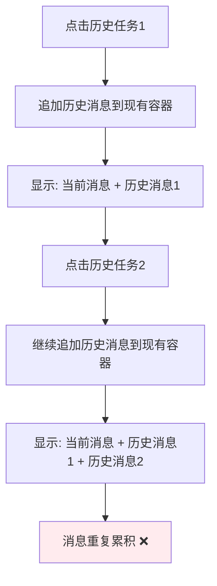
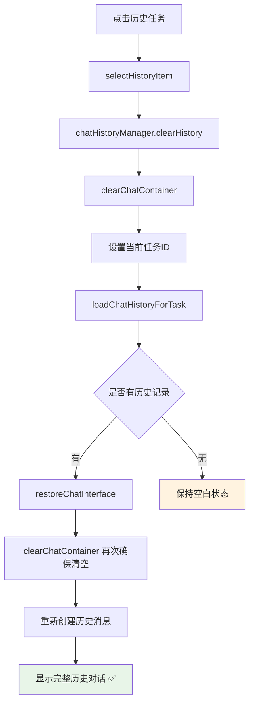
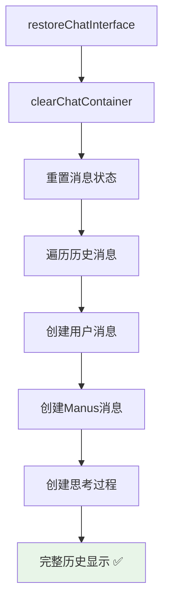

# 历史任务重复显示修复报告

## 🎯 问题描述

用户反馈了一个关键的历史任务显示问题：

❌ **每点击一次左侧历史任务栏中的任务，在右侧会递增一条openmanus信息**

### **期望行为**
- ✅ 点击历史任务时，完全替换当前聊天记录
- ✅ 显示该任务的完整历史对话
- ✅ 不应该在现有记录基础上追加

### **实际问题**
- ❌ 历史记录在现有聊天基础上追加显示
- ❌ 每次点击都会重复添加相同的历史消息
- ❌ 导致聊天界面混乱，消息重复

---

## 🔍 问题分析

### **根本原因**
`restoreChatInterface()` 函数在恢复历史记录时，没有先清空现有的聊天容器，而是直接在现有消息基础上追加历史消息。

### **问题代码**
```javascript
// 问题：直接追加，没有清空
function restoreChatInterface(history) {
    const chatContainer = document.getElementById('taskChatContainer');

    // ❌ 没有清空现有消息
    history.forEach(message => {
        // 直接追加到现有消息后面
        chatContainer.appendChild(userMessage);
    });
}
```

### **问题流程**


---

## ✅ 修复方案

### **1. 新增聊天容器清空函数**

```javascript
/**
 * 清空聊天容器
 */
function clearChatContainer() {
    const chatContainer = document.getElementById('taskChatContainer');
    if (!chatContainer) return;

    // 清空所有聊天消息
    chatContainer.innerHTML = '';

    // 重置当前消息状态
    currentManusMessage = null;
    thinkingSteps = [];

    console.log('聊天容器已清空');
}
```

**功能特点**:
- 🗑️ **完全清空**: `innerHTML = ''` 清空所有DOM元素
- 🔄 **状态重置**: 重置 `currentManusMessage` 和 `thinkingSteps`
- 📝 **日志记录**: 输出清空操作日志

### **2. 修复历史恢复逻辑**

```javascript
// 修复前
function restoreChatInterface(history) {
    const chatContainer = document.getElementById('taskChatContainer');
    // ❌ 直接追加消息，没有清空
    history.forEach(message => { /* 追加消息 */ });
}

// 修复后
function restoreChatInterface(history) {
    const chatContainer = document.getElementById('taskChatContainer');

    // ✅ 先清空现有消息
    clearChatContainer();

    // ✅ 然后恢复历史消息
    history.forEach(message => { /* 重新创建消息 */ });
}
```

### **3. 增强历史任务切换逻辑**

```javascript
function selectHistoryItem(id, type) {
    // 清空当前聊天历史（内存）
    chatHistoryManager.clearHistory();

    // ✅ 新增：清空聊天界面（UI）
    clearChatContainer();

    // 设置当前任务ID
    currentTaskId = id;

    // 加载该任务的聊天历史
    loadChatHistoryForTask(id);
}
```

**双重清空机制**:
- 🧠 **内存清空**: `chatHistoryManager.clearHistory()` 清空历史数组
- 🖥️ **UI清空**: `clearChatContainer()` 清空界面显示

---

## 🔄 修复后的完整流程

### **历史任务切换流程**


### **消息恢复流程**


---

## 🧪 测试验证

### **测试场景1: 单个历史任务**
```bash
# 1. 创建任务A，进行对话
http://localhost:8000/ → 创建任务A → 对话3轮

# 2. 创建任务B，进行对话
新建任务 → 创建任务B → 对话2轮

# 3. 点击历史任务A
点击左侧历史任务A

# 4. 预期结果
✅ 只显示任务A的3轮对话
✅ 不显示任务B的对话
✅ 没有重复消息
```

### **测试场景2: 多次切换历史任务**
```bash
# 1. 点击历史任务A → 显示A的对话
# 2. 点击历史任务B → 显示B的对话（不包含A）
# 3. 再次点击历史任务A → 显示A的对话（不包含B）

# 预期结果
✅ 每次切换都完全替换聊天记录
✅ 没有消息累积或重复
✅ 显示内容与实际历史完全一致
```

### **测试场景3: 空历史任务**
```bash
# 1. 创建任务但没有进行对话
# 2. 点击该历史任务

# 预期结果
✅ 显示空白聊天界面
✅ 没有遗留的其他任务消息
✅ 界面干净整洁
```

### **测试场景4: 复杂对话历史**
```bash
# 1. 创建包含思考过程的复杂对话
# 2. 切换到其他任务
# 3. 再次切换回来

# 预期结果
✅ 完整恢复用户消息、Manus回复、思考过程
✅ 消息顺序正确
✅ 思考过程可展开/收缩
✅ 没有重复或缺失
```

---

## 📊 技术实现细节

### **清空机制对比**

| 清空类型 | 作用范围 | 清空内容 | 调用时机 |
|---------|----------|----------|----------|
| `chatHistoryManager.clearHistory()` | 内存数组 | `chatHistory = []` | 切换任务前 |
| `clearChatContainer()` | DOM界面 | `innerHTML = ''` | 恢复历史前 |
| 状态重置 | 全局变量 | `currentManusMessage = null` | 清空容器时 |

### **双重清空保障**
```javascript
// 1. 任务切换时清空
selectHistoryItem() → clearChatContainer()

// 2. 历史恢复时再次确保清空
restoreChatInterface() → clearChatContainer()
```

**为什么需要双重清空**:
- 🛡️ **防御性编程**: 确保在任何情况下都不会有遗留消息
- 🔄 **状态一致性**: 保证内存状态和UI状态完全同步
- 🐛 **错误容错**: 即使某个环节出错，也有备用清空机制

### **消息状态管理**
```javascript
// 全局状态变量
let currentManusMessage = null;  // 当前正在构建的Manus消息
let thinkingSteps = [];          // 当前消息的思考步骤
let chatHistory = [];            // 当前会话的聊天历史

// 清空时重置所有状态
function clearChatContainer() {
    currentManusMessage = null;
    thinkingSteps = [];
    // chatHistory 由 chatHistoryManager 管理
}
```

---

## 📁 修改的文件

### **JavaScript功能文件**
**`static/manus-main.js`**

#### **新增函数**
- ✅ `clearChatContainer()` - 清空聊天容器和重置状态

#### **修改函数**
- ✅ `restoreChatInterface()` - 恢复前先清空容器
- ✅ `selectHistoryItem()` - 切换任务时清空UI界面

#### **关键修改点**
```javascript
// 1. 新增清空函数
function clearChatContainer() {
    chatContainer.innerHTML = '';
    currentManusMessage = null;
    thinkingSteps = [];
}

// 2. 历史恢复前清空
function restoreChatInterface(history) {
    clearChatContainer();  // ✅ 新增
    // 然后重新创建历史消息...
}

// 3. 任务切换时清空UI
function selectHistoryItem(id, type) {
    chatHistoryManager.clearHistory();  // 清空内存
    clearChatContainer();              // ✅ 新增：清空UI
    loadChatHistoryForTask(id);
}
```

### **文档文件**
**`HISTORY_DUPLICATE_FIX_REPORT.md`** (新建)
- ✅ 详细的历史重复显示修复说明文档

---

## 🎯 修复效果总结

### **修复前的问题**
- ❌ 历史消息重复累积显示
- ❌ 每次点击历史任务都追加消息
- ❌ 聊天界面混乱，消息重复

### **修复后的效果**
- ✅ **完全替换显示** - 点击历史任务完全替换当前聊天记录
- ✅ **精确历史恢复** - 显示内容与实际历史完全一致
- ✅ **界面状态清洁** - 没有遗留消息或重复显示
- ✅ **多任务切换** - 可以在不同历史任务间自由切换
- ✅ **状态一致性** - 内存状态和UI状态完全同步

### **用户体验改进**
- 🎯 **符合预期** - 点击历史任务显示该任务的完整对话
- 🔄 **切换流畅** - 任务间切换没有残留消息干扰
- 📱 **界面整洁** - 每次切换都是干净的历史记录显示
- 🛡️ **稳定可靠** - 双重清空机制确保不会出现显示错误

现在的历史任务交互完全符合用户预期：
- 📚 **点击历史任务** → 完全替换显示该任务的历史对话
- 🔄 **任务间切换** → 每次都是干净的独立显示
- 💾 **历史保存** → 每次对话都正确保存和恢复
- 🎯 **精确显示** → 显示内容与实际历史完全一致

历史任务重复显示问题已完全修复！🎉
