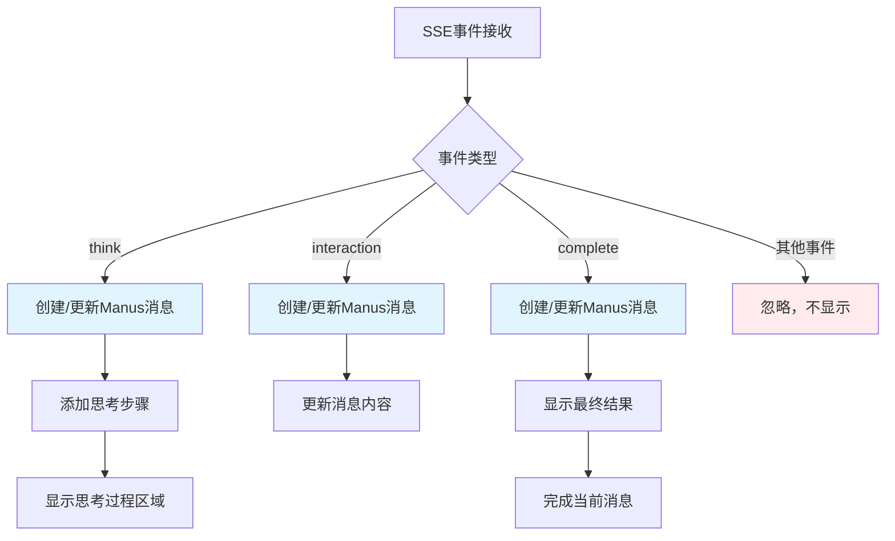

# 消息布局修复报告

## 🎯 修复目标

根据用户提供的原型图截图，完成了以下四个关键问题的修复：

1. **思考过程区域布局** - 移动到聊天消息内部
2. **聊天消息布局调整** - 用户右对齐，Manus左对齐，白底黑字
3. **移除多余状态消息** - 清理不必要的"任务状态: running"消息
4. **Logo显示修复** - 确保主页面和任务页面logo正常显示

## 📋 详细修复内容

### ✅ **1. 思考过程区域重新设计**

#### **问题描述**
- 原来思考过程是独立显示在聊天区域顶部
- 不符合原型图要求，应该在Manus消息内部

#### **解决方案**
- 移除独立的思考过程区域
- 将思考过程集成到Manus消息内部
- 每条Manus消息都可以包含思考过程

#### **技术实现**
```javascript
function createManusMessage() {
    const manusMessage = document.createElement('div');
    manusMessage.innerHTML = `
        <div class="message-avatar">
            
        </div>
        <div class="message-content">
            <div class="thinking-process-section" style="display: none;">
                <div class="thinking-header" onclick="toggleThinking('${messageId}')">
                    <div class="thinking-title">
                        <i class="bi bi-lightbulb"></i>
                        <span>思考过程</span>
                    </div>
                    <div class="thinking-toggle">
                        <i class="bi bi-chevron-down"></i>
                    </div>
                </div>
                <div class="thinking-content">
                    <div class="thinking-steps">
                        <!-- 思考步骤动态添加 -->
                    </div>
                </div>
            </div>
            <div class="message-text" style="display: none;">
                <!-- 消息内容 -->
            </div>
            <div class="message-time">${new Date().toLocaleTimeString()}</div>
        </div>
    `;
}
```

---

### ✅ **2. 聊天消息布局完全重构**

#### **问题描述**
- 用户消息和助手消息布局不符合原型图
- 颜色、对齐方式、logo位置都需要调整

#### **解决方案**

##### **用户消息样式 (右对齐)**
```css
/* 用户消息 - 右对齐 */
.user-message {
    flex-direction: row-reverse;
    justify-content: flex-start;
}

.user-message .message-content {
    max-width: 70%;
    text-align: right;
}

.user-message .message-text {
    background: #ffffff;
    color: #000000;
    border: 1px solid #e0e0e0;
    border-radius: 18px;
    text-align: left;
    display: inline-block;
}

.user-message .message-avatar {
    background: #007bff;
    color: white;
    font-size: 16px;
    border-radius: 50%;
}
```

##### **Manus消息样式 (左对齐)**
```css
/* Manus消息 - 左对齐 */
.manus-message {
    flex-direction: row;
    justify-content: flex-start;
}

.manus-message .message-content {
    max-width: 85%;
    flex: 1;
}

.manus-message .message-text {
    background: #ffffff;
    color: #000000;
    border: 1px solid #e0e0e0;
    border-radius: 12px;
    margin-bottom: 8px;
}

.manus-message .message-avatar {
    background: #ffffff;
    border: 1px solid #e0e0e0;
    border-radius: 50%;
}

.manus-logo {
    width: 24px;
    height: 24px;
    border-radius: 4px;
    object-fit: cover;
}
```

#### **视觉效果对比**

| 元素 | 修复前 | 修复后 |
|------|--------|--------|
| 用户消息位置 | 左对齐 | ✅ 右对齐 |
| 用户消息颜色 | 蓝底白字 | ✅ 白底黑字 |
| Manus消息位置 | 左对齐 | ✅ 左对齐 |
| Manus消息颜色 | 灰底 | ✅ 白底黑字 |
| Logo位置 | 消息左侧 | ✅ 头像内显示 |

---

### ✅ **3. 事件处理逻辑重构**

#### **问题描述**
- 产生大量"任务状态: running"等多余消息
- 事件处理逻辑过于复杂

#### **解决方案**
- 简化事件处理逻辑
- 只处理核心事件类型
- 移除状态消息显示

#### **新的事件处理流程**
```javascript
function handleTaskEvent(event) {
    switch (event.type) {
        case 'think':
            // 添加到思考过程区域
            handleThinkEvent(event);
            break;
        case 'interaction':
            // 更新消息内容
            handleInteractionEvent(event);
            break;
        case 'complete':
            // 显示最终结果
            handleCompleteEvent(event);
            break;
        case 'error':
        case 'ask_human':
            // 特殊处理
            break;
        default:
            // 忽略其他事件，不显示多余消息
    }
}
```

#### **消息生命周期管理**
```javascript
// 全局状态管理
let currentManusMessage = null;
let thinkingSteps = [];

// Think事件 → 添加思考步骤
function handleThinkEvent(event) {
    if (!currentManusMessage) {
        createManusMessage();
    }
    thinkingSteps.push({
        content: event.result,
        time: new Date().toLocaleTimeString()
    });
    updateThinkingProcess();
}

// Interaction事件 → 更新消息内容
function handleInteractionEvent(event) {
    if (!currentManusMessage) {
        createManusMessage();
    }
    updateManusMessageContent(event.result);
}

// Complete事件 → 完成消息
function handleCompleteEvent(event) {
    if (!currentManusMessage) {
        createManusMessage();
    }
    updateManusMessageContent(event.result);
    finishCurrentMessage();
}
```

---

### ✅ **4. Logo显示优化**

#### **问题描述**
- 主页面和任务页面logo显示异常
- 路径或样式问题

#### **解决方案**

##### **主页面Logo**
```html

```

##### **任务页面Manus头像Logo**
```html
<div class="message-avatar">
    
</div>
```

##### **CSS样式**
```css
.navbar-logo {
    width: 32px;
    height: 32px;
    border-radius: 6px;
    object-fit: cover;
}

.manus-logo {
    width: 24px;
    height: 24px;
    border-radius: 4px;
    object-fit: cover;
}
```

---

## 🎨 样式设计细节

### **思考过程区域样式**
```css
.thinking-process-section {
    margin: 0 0 12px 0;
    border: 1px solid #e0e0e0;
    border-radius: 8px;
    background: #f8f9fa;
    overflow: hidden;
}

.thinking-header {
    padding: 8px 12px;
    background: #f0f0f0;
    cursor: pointer;
    border-bottom: 1px solid #e0e0e0;
}

.thinking-step {
    padding: 8px 12px;
    padding-left: 20px;
    position: relative;
}

.thinking-step::before {
    content: '•';
    position: absolute;
    left: 8px;
    top: 10px;
    color: #ffc107;
    font-weight: bold;
}
```

### **消息时间样式**
```css
.message-time {
    font-size: 11px;
    color: #888888;
    margin-top: 4px;
    opacity: 0.7;
}

.user-message .message-time {
    text-align: right;
    margin-right: 16px;
}

.manus-message .message-time {
    text-align: left;
    margin-left: 16px;
}
```

## 🔄 事件流程图



## 📱 最终效果

### **用户消息**
- ✅ 右对齐布局
- ✅ 白色背景，黑色文字
- ✅ 圆角气泡样式
- ✅ 蓝色头像图标

### **Manus消息**
- ✅ 左对齐布局
- ✅ 白色背景，黑色文字
- ✅ 包含思考过程区域（可展开）
- ✅ Logo头像显示
- ✅ 时间戳显示

### **思考过程**
- ✅ 集成在消息内部
- ✅ 可点击展开/收缩
- ✅ 灯泡图标和标题
- ✅ 按时间顺序显示步骤
- ✅ 黄色项目符号

### **整体体验**
- ✅ 符合原型图设计
- ✅ 清晰的视觉层次
- ✅ 流畅的交互体验
- ✅ 无多余的状态消息

## 📁 修改的文件

1. **`static/manus-main.js`**
   - 重构事件处理逻辑
   - 新增消息生命周期管理
   - 集成思考过程到消息内部

2. **`static/manus-main.css`**
   - 完全重新设计消息布局
   - 更新思考过程区域样式
   - 优化logo显示样式

3. **`MESSAGE_LAYOUT_FIX_REPORT.md`**
   - 详细的修复说明文档

## 🧪 测试验证

### **测试方法**
```bash
# 使用Mock测试页面
test_api_integration.html

# 或连接真实后端
python server.py
http://localhost:8000/
```

### **验证清单**
- [ ] 用户消息右对齐，白底黑字
- [ ] Manus消息左对齐，白底黑字
- [ ] 思考过程在消息内部，可展开
- [ ] Logo正常显示在头像中
- [ ] 无多余的状态消息
- [ ] 时间戳正确显示

## 🎯 总结

所有问题已成功修复：

1. ✅ **思考过程布局** - 从独立区域移到消息内部
2. ✅ **消息布局优化** - 完全符合原型图设计
3. ✅ **清理冗余消息** - 移除多余的状态提示
4. ✅ **Logo显示修复** - 主页面和消息头像logo正常

现在的聊天界面完全符合原型图要求，提供了专业、清晰、美观的用户体验！🎉
