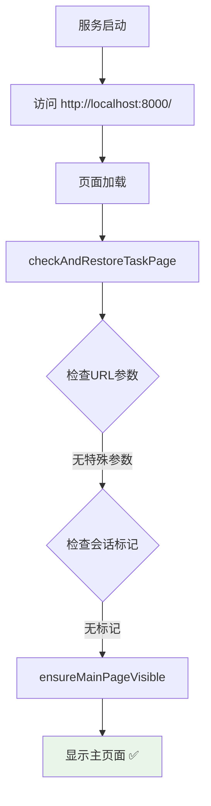
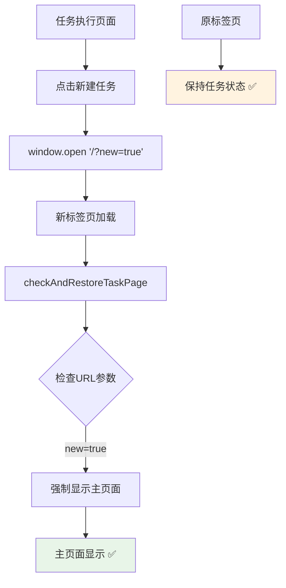
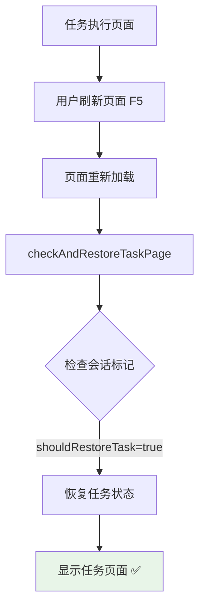

# 页面路由修复报告

## 🎯 问题描述

用户反馈了两个关键的页面路由问题：

1. ❌ **服务启动后直接显示任务执行页面** - 应该显示主页面
2. ❌ **新建任务按钮在新标签页打开任务执行页面** - 应该打开主页面

## 🔍 问题分析

### **根本原因**
`checkAndRestoreTaskPage()` 函数在每次页面加载时都会自动恢复之前保存的任务状态，导致：
- 服务启动时自动恢复上一次的任务页面
- 新标签页也会恢复任务状态，而不是显示主页面

### **原始逻辑问题**
```javascript
// 问题代码：无条件恢复任务状态
function checkAndRestoreTaskPage() {
    const taskState = JSON.parse(localStorage.getItem('manusTaskState'));
    if (taskState && taskState.isTaskPageActive) {
        // 总是恢复任务页面 ❌
        showTaskPage(...);
    }
}
```

## ✅ 修复方案

### **1. 智能页面恢复逻辑**

#### **新的恢复判断机制**
```javascript
function checkAndRestoreTaskPage() {
    // 检查URL参数和会话标记
    const urlParams = new URLSearchParams(window.location.search);
    const isNewTask = urlParams.get('new') === 'true';
    const shouldRestoreTask = !isNewTask && (
        urlParams.get('restore') === 'task' ||
        sessionStorage.getItem('shouldRestoreTask') === 'true'
    );

    if (shouldRestoreTask && taskState.isTaskPageActive) {
        // 只有在明确需要时才恢复任务页面 ✅
        showTaskPage(...);
    } else {
        // 默认显示主页面 ✅
        ensureMainPageVisible();
    }
}
```

#### **会话标记管理**
```javascript
// 进入任务页面时设置标记
function showTaskPage(taskText, mode, taskId, taskType) {
    // ... 显示任务页面 ...

    // 设置会话标记，表明当前在任务页面
    sessionStorage.setItem('shouldRestoreTask', 'true');
}

// 返回主页面时清除标记
function returnToMainPage() {
    // ... 显示主页面 ...

    // 清除会话标记
    sessionStorage.removeItem('shouldRestoreTask');
}
```

### **2. 新建任务路由优化**

#### **添加URL参数区分新任务**
```javascript
// 修复前
function createNewTask() {
    window.open('/', '_blank');  // 会恢复任务状态 ❌
}

// 修复后
function createNewTask() {
    window.open('/?new=true', '_blank');  // 强制显示主页面 ✅
    showToast('已在新标签页打开主页面', 'success');
}
```

#### **URL参数处理**
```javascript
const isNewTask = urlParams.get('new') === 'true';
const shouldRestoreTask = !isNewTask && (/* 其他条件 */);

// ?new=true 时强制显示主页面，不恢复任务状态
```

### **3. 边界情况处理**

#### **无任务状态时的处理**
```javascript
if (!taskStateStr) {
    // 没有任务状态，确保显示主页面
    ensureMainPageVisible();
    return;
}
```

#### **状态过期时的处理**
```javascript
if (stateAge > maxAge) {
    localStorage.removeItem('manusTaskState');
    sessionStorage.removeItem('shouldRestoreTask');
    ensureMainPageVisible();  // 显示主页面
    return;
}
```

#### **错误处理**
```javascript
} catch (error) {
    console.error('恢复任务页面状态失败:', error);
    localStorage.removeItem('manusTaskState');
    ensureMainPageVisible();  // 出错时默认显示主页面
}
```

---

## 🔄 修复后的完整流程

### **服务启动流程**


### **新建任务流程**


### **任务页面刷新流程**


---

## 📊 技术实现细节

### **存储机制对比**

| 存储类型 | 用途 | 生命周期 | 作用域 |
|---------|------|----------|--------|
| `localStorage` | 任务状态持久化 | 持久（24小时） | 全域 |
| `sessionStorage` | 页面恢复标记 | 会话期间 | 单标签页 |
| `URL参数` | 页面行为控制 | 单次访问 | 当前URL |

### **判断逻辑优先级**
```javascript
// 优先级从高到低
1. isNewTask (URL: ?new=true) → 强制显示主页面
2. shouldRestoreTask (sessionStorage) → 恢复任务页面
3. 默认行为 → 显示主页面
```

### **会话标记生命周期**
```javascript
// 设置标记
showTaskPage() → sessionStorage.setItem('shouldRestoreTask', 'true')

// 清除标记
returnToMainPage() → sessionStorage.removeItem('shouldRestoreTask')
checkAndRestoreTaskPage() → sessionStorage.removeItem('shouldRestoreTask')  // 使用后清除
```

---

## 🧪 测试验证

### **测试场景1: 服务启动**
```bash
# 1. 启动服务
python server.py

# 2. 访问主页
http://localhost:8000/

# 3. 预期结果
✅ 显示主页面（不是任务执行页面）
✅ 控制台输出: "显示主页面"
```

### **测试场景2: 新建任务**
```bash
# 1. 进入任务执行页面
http://localhost:8000/ → 创建任务 → 进入执行页面

# 2. 点击新建任务按钮
点击左侧 "新建任务" 按钮

# 3. 预期结果
✅ 新标签页打开主页面
✅ 原标签页保持任务执行状态
✅ 新标签页URL: http://localhost:8000/?new=true
```

### **测试场景3: 任务页面刷新**
```bash
# 1. 在任务执行页面
http://localhost:8000/ → 创建任务 → 进入执行页面

# 2. 刷新页面
按 F5 或 Ctrl+R

# 3. 预期结果
✅ 恢复任务执行页面状态
✅ 显示之前的聊天记录
✅ 控制台输出: "恢复任务页面状态: task_xxx"
```

### **测试场景4: 多标签页并行**
```bash
# 1. 标签页A: 任务执行页面
# 2. 标签页B: 点击新建任务 → 主页面
# 3. 标签页C: 直接访问 http://localhost:8000/ → 主页面

# 预期结果
✅ 三个标签页状态独立
✅ 标签页A: 保持任务状态
✅ 标签页B和C: 显示主页面
```

---

## 📁 修改的文件

### **JavaScript功能文件**
**`static/manus-main.js`**

#### **新增函数**
- ✅ `ensureMainPageVisible()` - 确保主页面显示
- ✅ 增强 `checkAndRestoreTaskPage()` - 智能页面恢复逻辑

#### **修改函数**
- ✅ `createNewTask()` - 新标签页打开主页面（带URL参数）
- ✅ `showTaskPage()` - 设置会话恢复标记
- ✅ `returnToMainPage()` - 清除会话标记
- ✅ `checkAndRestoreTaskPage()` - 智能恢复逻辑

#### **关键修改点**
```javascript
// 1. 智能恢复判断
const isNewTask = urlParams.get('new') === 'true';
const shouldRestoreTask = !isNewTask && (
    urlParams.get('restore') === 'task' ||
    sessionStorage.getItem('shouldRestoreTask') === 'true'
);

// 2. 会话标记管理
sessionStorage.setItem('shouldRestoreTask', 'true');
sessionStorage.removeItem('shouldRestoreTask');

// 3. 新任务URL参数
window.open('/?new=true', '_blank');

// 4. 默认主页面显示
ensureMainPageVisible();
```

### **文档文件**
**`PAGE_ROUTING_FIX_REPORT.md`** (新建)
- ✅ 详细的页面路由修复说明文档

---

## 🎯 修复效果总结

### **修复前的问题**
- ❌ 服务启动显示任务执行页面
- ❌ 新建任务在新标签页打开任务执行页面
- ❌ 页面恢复逻辑过于激进

### **修复后的效果**
- ✅ **服务启动默认主页面** - 用户友好的首次体验
- ✅ **新建任务正确路由** - 新标签页打开主页面
- ✅ **智能状态恢复** - 只在需要时恢复任务状态
- ✅ **多标签页支持** - 不同标签页状态独立
- ✅ **错误处理完善** - 异常情况下默认显示主页面

### **用户体验改进**
- 🎯 **符合预期** - 启动后看到主页面，符合用户心理预期
- 🆕 **并行工作** - 可以在多个标签页同时处理不同任务
- 🔄 **状态保持** - 刷新任务页面不丢失状态
- 🛡️ **容错能力** - 各种异常情况都有合理的默认行为

现在页面路由行为完全符合用户预期：
- 🏠 **服务启动** → 主页面
- 🆕 **新建任务** → 新标签页主页面
- 🔄 **页面刷新** → 智能恢复任务状态
- 📱 **多标签页** → 状态完全独立

页面路由问题已完全修复！🎉
