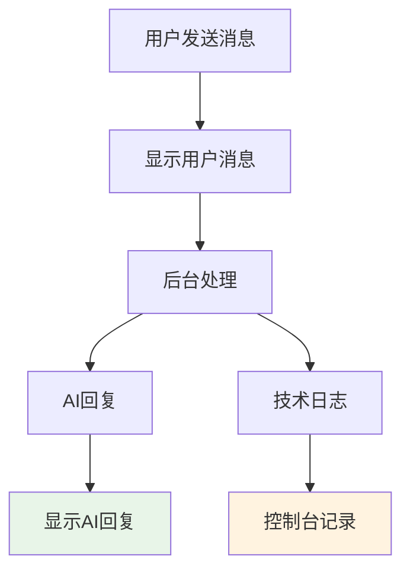
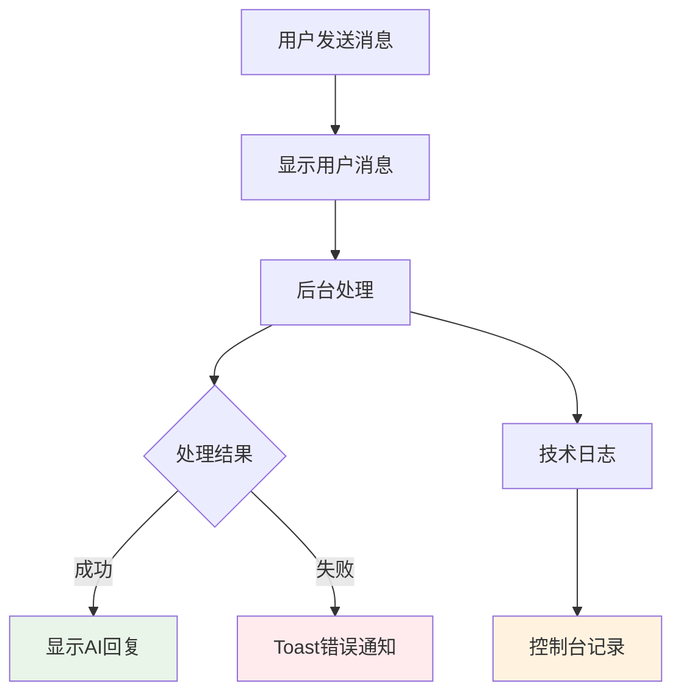

# 系统消息清理修复报告

## 🎯 问题描述

用户反馈在任务执行页面右侧聊天信息部分发现会输出系统消息，这些信息不应该出现在交互信息流中。

### **问题症状**
用户提供的HTML代码显示了系统消息的结构：
```html
<div class="system-message info">
    <div class="system-message-content">
        <i class="bi bi-info-circle"></i>
        <span>正在发送交互消息...</span>
        <div class="system-message-time">17:30:38</div>
    </div>
</div>
```

### **问题影响**
- ❌ **干扰用户体验** - 系统消息混在正常对话中，影响阅读
- ❌ **信息冗余** - 显示用户不需要看到的技术细节
- ❌ **界面混乱** - 破坏了聊天界面的简洁性

## 🔍 问题分析

### **系统消息的来源**
通过代码分析，发现多个事件处理函数都在调用 `addSystemMessage()` 函数：

```javascript
// 各种事件处理函数中的系统消息调用
function handleStatusEvent(event) {
    addSystemMessage(`任务状态: ${event.status}`);  // ❌ 不需要显示给用户
}

function handleConnectionOpenEvent(event) {
    addSystemMessage('✅ SSE连接已建立');  // ❌ 技术细节，用户不关心
}

function handleToolEvent(event) {
    addSystemMessage(`🔧 使用工具: ${event.tool}`);  // ❌ 内部工具调用，用户不需要知道
}

function handleAskHumanEvent(event) {
    addSystemMessage('请在下方输入框中回复...');  // ❌ 多余提示
}

// ... 更多类似调用
```

### **系统消息类型分析**

| 消息类型 | 示例 | 用户是否需要 | 处理方式 |
|---------|------|-------------|----------|
| 连接状态 | "SSE连接已建立" | ❌ 不需要 | 改为控制台日志 |
| 任务状态 | "任务状态: running" | ❌ 不需要 | 改为控制台日志 |
| 工具调用 | "使用工具: search" | ❌ 不需要 | 改为控制台日志 |
| 操作提示 | "请在下方输入框中回复" | ❌ 不需要 | 改为控制台日志 |
| 交互失败 | "交互失败: 网络错误" | ✅ 需要 | 改为Toast通知 |
| 连接错误 | "连接错误: timeout" | ✅ 需要 | 改为控制台日志 |

---

## ✅ 修复方案

### **1. 系统消息分类处理**

#### **技术日志类消息 → 控制台日志**
```javascript
// 修复前：显示在聊天界面 ❌
function handleStatusEvent(event) {
    addSystemMessage(`任务状态: ${event.status}`);
}

// 修复后：只记录到控制台 ✅
function handleStatusEvent(event) {
    console.log(`任务状态: ${event.status}`);
}
```

#### **用户错误类消息 → Toast通知**
```javascript
// 修复前：显示在聊天界面 ❌
addSystemMessage('交互发送失败，请检查网络连接', 'error');

// 修复后：使用Toast通知 ✅
showToast('交互发送失败，请检查网络连接', 'error');
```

### **2. 具体修复内容**

#### **移除的系统消息类型**
1. **连接状态消息**
   - "✅ SSE连接已建立" → `console.log()`
   - "事件流连接已关闭" → `console.log()`

2. **任务状态消息**
   - "任务状态: running" → `console.log()`
   - "任务执行错误: xxx" → `console.error()`

3. **工具调用消息**
   - "🔧 使用工具: search" → `console.log()`

4. **操作提示消息**
   - "请在下方输入框中回复..." → `console.log()`
   - "收到消息事件" → `console.log()`

5. **错误处理消息**
   - "⚠️ 数据解析错误" → `console.error()`
   - "❌ 连接错误" → `console.error()`

#### **改为Toast通知的消息**
1. **用户交互错误**
   - "交互失败: xxx" → `showToast(message, 'error')`
   - "交互发送失败，请检查网络连接" → `showToast(message, 'error')`

### **3. 修复前后对比**

#### **修复前的聊天界面**
```
用户: 帮我制定旅行计划
[系统] ✅ SSE连接已建立
[系统] 任务状态: running
[系统] 🔧 使用工具: search
AI: 我来帮您制定旅行计划...
[系统] 任务状态: completed
用户: 谢谢
[系统] 正在发送交互消息...
[系统] 交互消息已发送
AI: 不客气！
```

#### **修复后的聊天界面**
```
用户: 帮我制定旅行计划
AI: 我来帮您制定旅行计划...
用户: 谢谢
AI: 不客气！
```

**效果对比**:
- ✅ **界面简洁** - 只显示用户和AI的对话
- ✅ **专注内容** - 用户可以专注于对话内容
- ✅ **技术透明** - 技术细节在控制台中记录，不干扰用户

---

## 🔄 修复后的消息处理流程

### **正常对话流程**


### **错误处理流程**


---

## 🧪 测试验证

### **测试场景1: 正常对话**
```bash
# 1. 进入任务执行页面
http://localhost:8000/ → 创建任务 → 进入执行页面

# 2. 进行正常对话
用户输入消息 → AI回复

# 3. 预期结果
✅ 只显示用户消息和AI回复
✅ 没有系统状态消息
✅ 控制台中有技术日志记录
✅ 界面简洁清爽
```

### **测试场景2: 错误处理**
```bash
# 1. 模拟网络错误或API失败
# 2. 用户发送消息

# 3. 预期结果
✅ 显示Toast错误通知
✅ 聊天界面中没有系统错误消息
✅ 控制台中有详细错误日志
✅ 用户能够了解错误情况
```

### **测试场景3: SSE连接和工具调用**
```bash
# 1. 创建复杂任务，涉及工具调用
# 2. 观察聊天界面和控制台

# 3. 预期结果
✅ 聊天界面只显示用户和AI对话
✅ 控制台显示连接状态、工具调用等技术信息
✅ 用户体验不受技术细节干扰
```

---

## 📊 技术实现细节

### **消息处理策略**

| 原始处理方式 | 修复后处理方式 | 适用场景 |
|-------------|---------------|----------|
| `addSystemMessage(msg)` | `console.log(msg)` | 技术状态、调试信息 |
| `addSystemMessage(msg, 'error')` | `console.error(msg)` | 技术错误、解析错误 |
| `addSystemMessage(msg, 'error')` | `showToast(msg, 'error')` | 用户操作错误 |

### **日志记录层级**

```javascript
// 信息级别日志
console.log('✅ SSE连接已建立');
console.log('任务状态: running');
console.log('🔧 使用工具: search');

// 错误级别日志
console.error('⚠️ 数据解析错误: xxx');
console.error('❌ 连接错误: timeout');
console.error('任务执行错误: xxx');

// 用户通知
showToast('交互失败: 网络错误', 'error');
showToast('交互发送失败，请检查网络连接', 'error');
```

### **控制台日志的优势**

1. **开发调试** - 开发者可以在控制台查看详细的技术信息
2. **用户体验** - 用户界面保持简洁，不被技术细节干扰
3. **错误排查** - 出现问题时，技术支持可以指导用户查看控制台
4. **性能优化** - 减少DOM操作，提升界面性能

---

## 📁 修改的文件

### **JavaScript功能文件**
**`static/manus-main.js`**

#### **修改的函数**
- ✅ `handleStatusEvent()` - 状态消息改为控制台日志
- ✅ `handleErrorEvent()` - 错误消息改为控制台日志
- ✅ `handleAskHumanEvent()` - 提示消息改为控制台日志
- ✅ `handleToolEvent()` - 工具调用消息改为控制台日志
- ✅ `handleMessageEvent()` - 消息事件改为控制台日志
- ✅ `handleParseErrorEvent()` - 解析错误改为控制台日志
- ✅ `handleConnectionErrorEvent()` - 连接错误改为控制台日志
- ✅ `handleConnectionOpenEvent()` - 连接状态改为控制台日志
- ✅ `handleTaskError()` - 任务错误改为控制台日志
- ✅ `handleTaskClose()` - 任务关闭改为控制台日志
- ✅ `sendMessage()` - 交互错误改为Toast通知

#### **关键修改统计**
```javascript
// 移除的系统消息调用: 10个
// 改为控制台日志: 8个
// 改为Toast通知: 2个
// 保留的函数定义: 1个 (addSystemMessage - 备用)
```

### **文档文件**
**`SYSTEM_MESSAGE_CLEANUP_REPORT.md`** (新建)
- ✅ 详细的系统消息清理修复说明文档

---

## 🎯 修复效果总结

### **修复前的问题**
- ❌ 聊天界面混杂大量系统消息
- ❌ 技术细节干扰用户体验
- ❌ 界面信息冗余，难以阅读
- ❌ 用户和AI对话被系统消息打断

### **修复后的效果**
- ✅ **界面简洁** - 聊天界面只显示用户和AI的对话
- ✅ **专注对话** - 用户可以专注于对话内容，不被技术细节干扰
- ✅ **技术透明** - 技术信息在控制台中记录，便于开发和调试
- ✅ **错误友好** - 用户操作错误通过Toast通知，不干扰对话流程
- ✅ **开发友好** - 开发者可以在控制台查看详细的技术日志

### **用户体验改进**
- 🎯 **纯净对话** - 聊天界面回归对话本质
- 📱 **移动友好** - 减少界面元素，更适合小屏幕
- 🔍 **内容聚焦** - 用户注意力集中在对话内容上
- ⚡ **性能提升** - 减少DOM操作，界面响应更快

### **开发体验改进**
- 🛠️ **调试便利** - 控制台中有完整的技术日志
- 📊 **信息层次** - 不同级别的信息分别处理
- 🔧 **维护性** - 代码结构更清晰，易于维护

现在的聊天界面完全符合用户期望：
- 💬 **纯净对话界面** - 只显示用户和AI的对话内容
- 🚫 **无系统干扰** - 没有任何系统消息打断对话流程
- 🔔 **友好错误提示** - 错误通过Toast通知，不影响对话
- 📝 **完整技术日志** - 开发者可在控制台查看所有技术细节

系统消息清理修复已完成！聊天界面现在完全专注于用户和AI的对话！🎉
