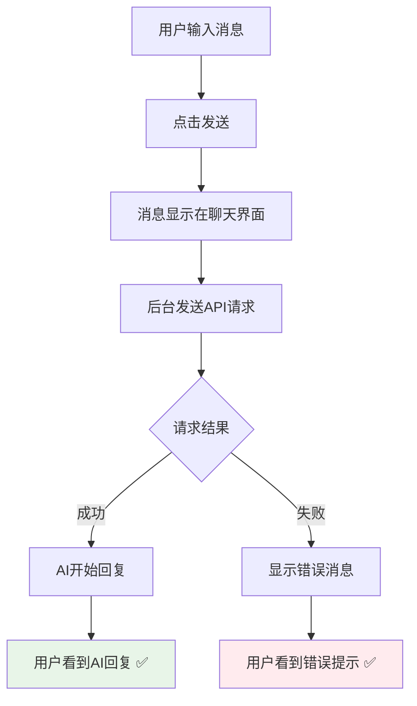
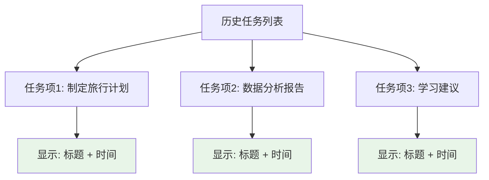

# UI界面清理修复报告

## 🎯 问题描述

用户反馈了两个UI界面的优化需求：

1. ❌ **交互信息页面出现多余信息展示** - 聊天界面显示不必要的状态消息
2. ❌ **左侧历史任务栏显示Chat/Flow标签** - 每个任务下方显示任务类型，但实际上每个任务可以有不同模式的多次交互

## 🔍 问题分析

### **问题1: 多余的交互状态消息**
根据用户提供的截图，红框中显示了以下多余信息：
- "正在发送交互消息..."
- "交互消息已发送"

#### **问题根源**
```javascript
// 问题代码：在sendMessage函数中添加了状态消息
if (currentTaskId || currentFlowId) {
    try {
        addSystemMessage('正在发送交互消息...');  // ❌ 多余的状态消息

        const result = await apiClient.handleInteraction(...);

        if (result.success) {
            addSystemMessage('交互消息已发送');  // ❌ 多余的状态消息
        }
    } catch (error) {
        // ...
    }
}
```

#### **用户体验问题**
- 🚫 **信息冗余**: 用户已经发送了消息，不需要额外的状态确认
- 🚫 **界面混乱**: 状态消息干扰了正常的对话流程
- 🚫 **视觉噪音**: 不必要的消息增加了界面复杂度

### **问题2: 历史任务的类型标签**
每个历史任务项下方显示"Chat"或"Agent"标签

#### **问题根源**
```javascript
// 问题代码：在历史任务HTML中显示任务类型
<div class="history-item-content">
    <div class="history-item-title">${title}</div>
    <div class="history-item-time">${time}</div>
    <div class="history-item-type">${item.type === 'flow' ? 'Agent' : 'Chat'}</div>  // ❌ 不需要的标签
</div>
```

#### **用户反馈的合理性**
- 💡 **任务模式灵活性**: 每个任务可以有不同模式的多次交互
- 💡 **标签误导性**: 固定的Chat/Flow标签可能不准确反映任务的实际交互模式
- 💡 **界面简洁性**: 移除标签可以让历史列表更加简洁

---

## ✅ 修复方案

### **1. 移除多余的交互状态消息**

#### **修复前的代码**
```javascript
// ❌ 问题：添加了不必要的状态消息
if (currentTaskId || currentFlowId) {
    try {
        addSystemMessage('正在发送交互消息...');  // 移除

        const result = await apiClient.handleInteraction(...);

        if (result.success) {
            addSystemMessage('交互消息已发送');  // 移除
            console.log('交互成功:', result);
        } else {
            addSystemMessage(`交互失败: ${result.error}`, 'error');  // 保留错误消息
        }
    } catch (error) {
        addSystemMessage('交互发送失败，请检查网络连接', 'error');  // 保留错误消息
    }
}
```

#### **修复后的代码**
```javascript
// ✅ 修复：只保留必要的错误消息，移除成功状态消息
if (currentTaskId || currentFlowId) {
    try {
        const result = await apiClient.handleInteraction(...);

        if (result.success) {
            console.log('交互成功:', result);  // 只在控制台记录
        } else {
            addSystemMessage(`交互失败: ${result.error}`, 'error');  // 保留错误消息
        }
    } catch (error) {
        addSystemMessage('交互发送失败，请检查网络连接', 'error');  // 保留错误消息
    }
}
```

**修复原则**:
- ✅ **保留错误消息** - 用户需要知道交互失败的情况
- ✅ **移除成功消息** - 成功的交互通过AI回复本身就能体现
- ✅ **简化用户界面** - 减少不必要的视觉干扰

### **2. 移除历史任务的类型标签**

#### **修复前的HTML结构**
```javascript
// ❌ 问题：显示固定的任务类型标签
<div class="history-item-content">
    <div class="history-item-title">${title}</div>
    <div class="history-item-time">${time}</div>
    <div class="history-item-type">${item.type === 'flow' ? 'Agent' : 'Chat'}</div>  // 移除这行
</div>
```

#### **修复后的HTML结构**
```javascript
// ✅ 修复：简洁的历史任务显示
<div class="history-item-content">
    <div class="history-item-title">${title}</div>
    <div class="history-item-time">${time}</div>
    <!-- 移除了 history-item-type 元素 -->
</div>
```

**修复效果**:
- ✅ **界面简洁** - 历史任务列表更加简洁明了
- ✅ **避免误导** - 不再显示可能不准确的固定类型标签
- ✅ **专注内容** - 用户可以专注于任务的实际内容而不是类型

---

## 🔄 修复后的用户体验

### **交互消息发送流程**


**改进点**:
- 🚫 **移除**: "正在发送交互消息..."
- 🚫 **移除**: "交互消息已发送"
- ✅ **保留**: 错误消息提示
- ✅ **保留**: 控制台日志记录

### **历史任务列表显示**


**改进点**:
- 🚫 **移除**: Chat/Agent 类型标签
- ✅ **保留**: 任务标题和时间
- ✅ **简化**: 界面更加简洁

---

## 🧪 测试验证

### **测试场景1: 交互消息发送**
```bash
# 1. 进入任务执行页面
http://localhost:8000/ → 创建任务 → 进入执行页面

# 2. 发送交互消息
在底部输入框输入消息 → 按回车发送

# 3. 预期结果
✅ 用户消息立即显示在聊天界面
✅ 没有"正在发送交互消息..."提示
✅ 没有"交互消息已发送"提示
✅ AI回复正常显示
✅ 如果出错，显示错误消息
```

### **测试场景2: 历史任务列表显示**
```bash
# 1. 创建多个不同类型的任务
# - Chat任务: "帮我制定旅行计划"
# - Flow任务: "分析数据报告"

# 2. 查看左侧历史任务列表

# 3. 预期结果
✅ 每个任务只显示标题和时间
✅ 没有"Chat"或"Agent"标签
✅ 界面简洁清爽
✅ 点击任务正常切换
```

### **测试场景3: 错误处理**
```bash
# 1. 模拟网络错误或API失败
# 2. 发送交互消息

# 3. 预期结果
✅ 显示具体的错误消息
✅ 用户能够了解失败原因
✅ 没有混淆的成功/失败状态消息
```

---

## 📊 技术实现细节

### **消息状态管理策略**

| 消息类型 | 修复前 | 修复后 | 原因 |
|---------|--------|--------|------|
| 发送中状态 | ❌ 显示"正在发送..." | ✅ 不显示 | 用户已知自己发送了消息 |
| 发送成功 | ❌ 显示"消息已发送" | ✅ 不显示 | AI回复本身就是成功确认 |
| 发送失败 | ✅ 显示错误信息 | ✅ 保留显示 | 用户需要知道失败原因 |
| 网络错误 | ✅ 显示网络错误 | ✅ 保留显示 | 用户需要排查网络问题 |

### **历史任务显示策略**

| 显示元素 | 修复前 | 修复后 | 原因 |
|---------|--------|--------|------|
| 任务标题 | ✅ 显示 | ✅ 保留 | 核心信息，必须显示 |
| 创建时间 | ✅ 显示 | ✅ 保留 | 帮助用户识别任务 |
| 任务类型标签 | ❌ 显示Chat/Agent | ✅ 移除 | 可能误导，任务模式可变 |

### **代码清理效果**

```javascript
// 清理前：冗余的状态管理
addSystemMessage('正在发送交互消息...');  // -1 行冗余代码
// ... API调用 ...
addSystemMessage('交互消息已发送');        // -1 行冗余代码

// 清理后：简洁的错误处理
// ... API调用 ...
if (result.success) {
    console.log('交互成功:', result);  // 仅日志记录
} else {
    addSystemMessage(`交互失败: ${result.error}`, 'error');  // 必要的错误提示
}
```

---

## 📁 修改的文件

### **JavaScript功能文件**
**`static/manus-main.js`**

#### **修改函数**
- ✅ `sendMessage()` - 移除多余的交互状态消息
- ✅ `renderHistoryRecords()` - 移除历史任务的类型标签

#### **关键修改点**
```javascript
// 1. 移除交互状态消息
// 修改前
addSystemMessage('正在发送交互消息...');
addSystemMessage('交互消息已发送');

// 修改后
// 直接进行API调用，不显示状态消息

// 2. 移除历史任务类型标签
// 修改前
<div class="history-item-type">${item.type === 'flow' ? 'Agent' : 'Chat'}</div>

// 修改后
// 完全移除这个元素
```

### **文档文件**
**`UI_CLEANUP_FIX_REPORT.md`** (新建)
- ✅ 详细的UI界面清理修复说明文档

---

## 🎯 修复效果总结

### **修复前的问题**
- ❌ 交互消息发送时显示多余的状态提示
- ❌ 历史任务列表显示固定的Chat/Agent标签
- ❌ 界面信息冗余，视觉噪音较多

### **修复后的效果**
- ✅ **交互流程简洁** - 移除不必要的状态消息，交互更加流畅
- ✅ **历史列表简洁** - 只显示任务标题和时间，界面更加清爽
- ✅ **错误处理保留** - 仍然显示必要的错误信息，不影响用户排错
- ✅ **用户体验优化** - 减少视觉干扰，让用户专注于内容本身

### **用户体验改进**
- 🎯 **专注对话内容** - 移除干扰性的状态消息
- 🔄 **简洁的历史管理** - 历史任务列表更加简洁明了
- 🛡️ **保留必要提示** - 错误消息仍然正常显示
- 📱 **界面一致性** - 整体界面风格更加统一简洁

现在的界面更加简洁和用户友好：
- 💬 **交互消息** → 直接显示用户消息和AI回复，无多余状态
- 📚 **历史任务** → 只显示标题和时间，无类型标签干扰
- ⚠️ **错误处理** → 保留必要的错误提示，确保用户体验
- 🎨 **视觉效果** → 界面更加简洁，减少视觉噪音

UI界面清理优化已完成！🎉
