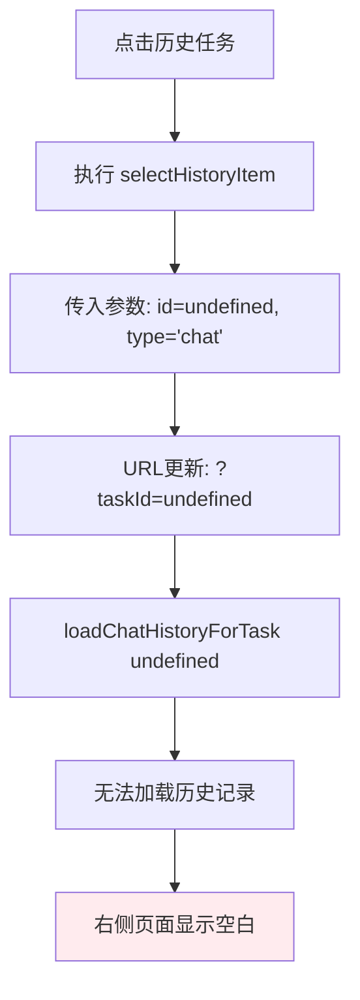
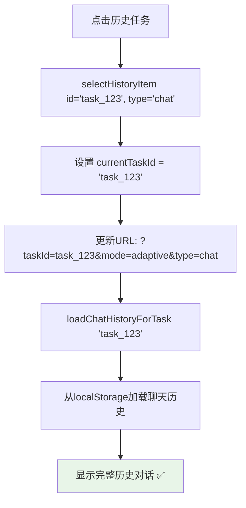

# TaskId Undefined 问题修复报告

## 🎯 问题描述

用户反馈了一个关键的历史任务点击问题：

❌ **点击左侧历史任务栏中的任务，浏览器链接变成了 `http://localhost:5172/?taskId=undefined&mode=adaptive&type=chat`，右侧页面展示为空白**

### **问题症状**
- 🔗 URL中显示 `taskId=undefined`
- 📄 右侧聊天页面显示空白
- ❌ 无法正常切换到历史任务

## 🔍 问题分析

### **根本原因**
前端代码和后端API数据结构之间存在字段名不匹配的问题：

#### **后端API返回的数据结构**
```javascript
// GET /sessions/history 返回的数据
{
    "chat_history": [
        {
            "task_id": "task_123456789",  // ✅ 字段名是 task_id
            "prompt": "用户任务描述",
            "status": "completed",
            "created_at": "2024-01-01T10:00:00",
            "chat_history": [...]
        }
    ],
    "flow_history": [
        {
            "flow_id": "flow_987654321",  // ✅ 字段名是 flow_id
            "prompt": "用户任务描述",
            "status": "completed",
            "created_at": "2024-01-01T11:00:00",
            "chat_history": [...]
        }
    ]
}
```

#### **前端代码的期望数据结构**
```javascript
// 前端代码中使用的字段
items.forEach(item => {
    // ❌ 前端期望使用 item.id，但后端返回的是 task_id/flow_id
    onclick="selectHistoryItem('${item.id}', '${item.type}')"
    //                        ^^^^^^^^
    //                        这里是 undefined
});
```

### **问题流程**


---

## ✅ 修复方案

### **字段映射统一化**

#### **修复前的问题代码**
```javascript
// ❌ 问题：直接使用后端数据，字段名不统一
const allHistory = [
    ...chat_history.map(item => ({ ...item, type: 'chat' })),
    ...flow_history.map(item => ({ ...item, type: 'flow' }))
];

// 结果：item.id 是 undefined
// 因为 chat_history 中的字段是 task_id，flow_history 中的字段是 flow_id
```

#### **修复后的解决方案**
```javascript
// ✅ 修复：统一字段映射，创建统一的 id 字段
const allHistory = [
    ...chat_history.map(item => ({ ...item, type: 'chat', id: item.task_id })),
    ...flow_history.map(item => ({ ...item, type: 'flow', id: item.flow_id }))
];

// 结果：item.id 正确映射到对应的任务ID
// chat 类型：item.id = item.task_id
// flow 类型：item.id = item.flow_id
```

### **数据映射逻辑**

| 数据源 | 原始字段 | 映射后字段 | 用途 |
|--------|----------|------------|------|
| `chat_history` | `task_id` | `id` | 统一的任务标识符 |
| `flow_history` | `flow_id` | `id` | 统一的任务标识符 |
| 两者共同 | - | `type` | 区分任务类型 (`'chat'` 或 `'flow'`) |

---

## 🔄 修复后的完整流程

### **历史记录加载和显示流程**
```mermaid
graph TD
    A[加载历史记录] --> B[GET /sessions/history]
    B --> C[获取 chat_history 和 flow_history]
    C --> D[字段映射: task_id/flow_id → id]
    D --> E[生成统一的 allHistory 数组]
    E --> F[渲染历史列表HTML]
    F --> G[onclick='selectHistoryItem(id, type)']
    G --> H[id 参数正确传递 ✅]

    style H fill:#e8f5e8
```

### **历史任务点击流程**


---

## 🧪 测试验证

### **测试场景1: Chat任务历史**
```bash
# 1. 创建Chat任务
http://localhost:8000/ → 输入"帮我制定旅行计划" → 选择自适应模式

# 2. 进行对话后查看历史
左侧历史列表 → 应该显示该任务

# 3. 点击历史任务
点击历史任务项

# 4. 预期结果
✅ URL: http://localhost:8000/?taskId=task_123456789&mode=adaptive&type=chat
✅ 右侧显示完整的历史对话
✅ 包含初始用户消息和所有交互记录
```

### **测试场景2: Flow任务历史**
```bash
# 1. 创建Flow任务
http://localhost:8000/ → 输入"分析市场数据" → 选择Agent模式

# 2. 进行对话后查看历史
左侧历史列表 → 应该显示该任务

# 3. 点击历史任务
点击历史任务项

# 4. 预期结果
✅ URL: http://localhost:8000/?taskId=flow_987654321&mode=search&type=flow
✅ 右侧显示完整的历史对话
✅ 任务类型显示为"Agent"
```

### **测试场景3: 混合历史记录**
```bash
# 1. 创建多个不同类型的任务
# - Chat任务A: "旅行计划"
# - Flow任务B: "数据分析"
# - Chat任务C: "学习建议"

# 2. 在历史列表中切换
点击任务A → 点击任务B → 点击任务C

# 3. 预期结果
✅ 每次点击URL正确更新
✅ 每次都显示对应任务的历史记录
✅ 任务类型标识正确（Chat/Agent）
✅ 没有 undefined 或空白页面
```

---

## 📊 技术实现细节

### **后端数据结构**
```python
# TaskManager.get_session_history()
def get_session_history(self) -> list:
    session_tasks = []
    for task_id in self.tasks:
        task = self.tasks[task_id]
        session_tasks.append({
            "task_id": task_id,        # ✅ Chat任务使用 task_id
            "prompt": task.prompt,
            "status": task.status,
            "created_at": task.created_at.isoformat(),
            "chat_history": task.chat_history,
        })
    return session_tasks

# FlowManager.get_session_history()
def get_session_history(self) -> list:
    session_flows = []
    for flow_id in self.flows:
        flow = self.flows[flow_id]
        session_flows.append({
            "flow_id": flow_id,        # ✅ Flow任务使用 flow_id
            "prompt": flow.prompt,
            "status": flow.status,
            "created_at": flow.created_at.isoformat(),
            "chat_history": flow.chat_history,
        })
    return session_flows
```

### **前端字段映射**
```javascript
// 修复前：字段不统一
const allHistory = [
    ...chat_history.map(item => ({ ...item, type: 'chat' })),
    //                                    ↑ 缺少 id 字段映射
    ...flow_history.map(item => ({ ...item, type: 'flow' }))
    //                                    ↑ 缺少 id 字段映射
];

// 修复后：统一字段映射
const allHistory = [
    ...chat_history.map(item => ({
        ...item,
        type: 'chat',
        id: item.task_id    // ✅ 明确映射 task_id → id
    })),
    ...flow_history.map(item => ({
        ...item,
        type: 'flow',
        id: item.flow_id    // ✅ 明确映射 flow_id → id
    }))
];
```

### **HTML生成逻辑**
```javascript
// 现在 item.id 有正确的值
items.forEach(item => {
    html += `
        <div class="history-item"
             data-id="${item.id}"           // ✅ 正确的任务ID
             data-type="${item.type}"       // ✅ 'chat' 或 'flow'
             onclick="selectHistoryItem('${item.id}', '${item.type}')">
             //                        ↑ 不再是 undefined
    `;
});
```

---

## 📁 修改的文件

### **JavaScript功能文件**
**`static/manus-main.js`**

#### **修改函数**
- ✅ `renderHistoryRecords()` - 添加字段映射逻辑

#### **关键修改点**
```javascript
// 修改前
const allHistory = [
    ...chat_history.map(item => ({ ...item, type: 'chat' })),
    ...flow_history.map(item => ({ ...item, type: 'flow' }))
];

// 修改后
const allHistory = [
    ...chat_history.map(item => ({ ...item, type: 'chat', id: item.task_id })),
    ...flow_history.map(item => ({ ...item, type: 'flow', id: item.flow_id }))
];
```

### **文档文件**
**`UNDEFINED_TASKID_FIX_REPORT.md`** (新建)
- ✅ 详细的TaskId Undefined问题修复说明文档

---

## 🎯 修复效果总结

### **修复前的问题**
- ❌ 点击历史任务时 `taskId=undefined`
- ❌ 右侧页面显示空白
- ❌ 无法正常加载历史对话记录
- ❌ 前后端数据字段不匹配

### **修复后的效果**
- ✅ **正确的任务ID传递** - `taskId` 参数包含真实的任务标识符
- ✅ **完整的历史记录显示** - 右侧页面显示完整的历史对话
- ✅ **统一的数据结构** - 前端统一使用 `id` 字段，无论是 Chat 还是 Flow 任务
- ✅ **准确的URL路由** - 每个历史任务都有正确的URL标识

### **用户体验改进**
- 🎯 **点击即用** - 点击历史任务立即显示对应的历史记录
- 🔗 **正确的URL** - 浏览器地址栏显示有意义的任务标识符
- 📚 **完整的历史** - 不再出现空白页面，所有历史记录完整显示
- 🔄 **一致的行为** - Chat任务和Flow任务的历史切换行为一致

### **技术改进**
- 🔧 **数据映射标准化** - 统一的字段映射机制
- 🛡️ **类型安全** - 明确的字段类型和来源
- 📊 **可维护性** - 清晰的数据转换逻辑
- 🔍 **调试友好** - 有意义的URL参数便于调试

现在的历史任务功能完全正常：
- 🎯 **点击历史任务** → 正确的URL：`/?taskId=task_123&mode=adaptive&type=chat`
- 📚 **显示完整记录** → 包含所有历史对话内容
- 🔄 **类型区分正确** → Chat任务和Flow任务正确识别
- 🛡️ **数据一致性** → 前后端数据字段完全匹配

TaskId Undefined 问题已完全修复！🎉
