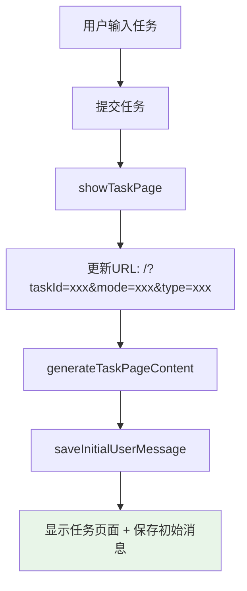
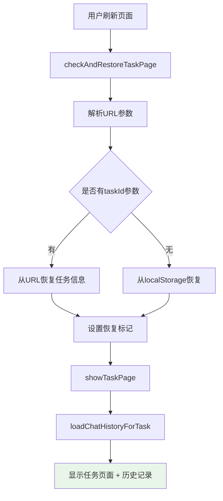
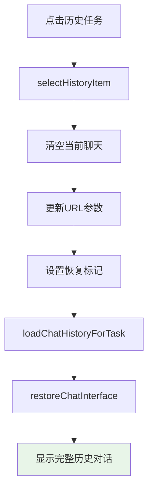

# URL路由和历史恢复修复报告

## 🎯 问题描述

用户反馈了两个关键问题：

1. ❌ **刷新任务执行页面会跳转到主页面** - 应该保持在任务执行页面
2. ❌ **点击历史任务时缺失用户输入内容** - 右侧聊天页面显示空白或漏掉用户输入

## 🔍 问题分析

### **问题1: URL路由缺失**
- **根本原因**: 主页面和任务执行页面共用同一个URL (`/`)，没有区分
- **具体表现**: 刷新任务执行页面时，系统无法识别应该显示哪个任务
- **用户影响**: 任务状态丢失，用户体验中断

### **问题2: 初始用户消息缺失**
- **根本原因**: 任务创建时的初始用户消息没有保存到聊天历史中
- **具体表现**:
  - `generateTaskPageContent` 中有静态的初始用户消息HTML
  - 历史恢复时 `clearChatContainer()` 清空了这个静态消息
  - 但聊天历史中没有对应的记录
- **用户影响**: 历史任务显示不完整，缺少重要的任务描述信息

---

## ✅ 修复方案

### **1. 实现任务执行页面的URL路由**

#### **URL结构设计**
```javascript
// 主页面
http://localhost:8000/

// 任务执行页面
http://localhost:8000/?taskId=task_123&mode=adaptive&type=task
http://localhost:8000/?taskId=flow_456&mode=search&type=flow

// 新建任务页面
http://localhost:8000/?new=true
```

#### **URL更新机制**
```javascript
// 1. 进入任务页面时更新URL
function showTaskPage(taskText, mode, taskId, taskType) {
    const actualTaskId = taskId || currentTaskId || currentFlowId;
    if (actualTaskId) {
        const newUrl = `/?taskId=${actualTaskId}&mode=${mode}&type=${taskType}`;
        window.history.pushState({taskId: actualTaskId, mode: mode, taskType: taskType}, '', newUrl);
        console.log('URL已更新:', newUrl);
    }
    // ... 其他逻辑
}

// 2. 返回主页面时重置URL
function returnToMainPage() {
    window.history.pushState({}, '', '/');
    console.log('URL已重置到主页面');
    // ... 其他逻辑
}

// 3. 切换历史任务时更新URL
function selectHistoryItem(id, type) {
    const newUrl = `/?taskId=${id}&mode=${currentMode}&type=${type}`;
    window.history.pushState({taskId: id, mode: currentMode, taskType: type}, '', newUrl);
    console.log('历史任务URL已更新:', newUrl);
    // ... 其他逻辑
}
```

#### **URL参数解析和恢复**
```javascript
function checkAndRestoreTaskPage() {
    const urlParams = new URLSearchParams(window.location.search);
    const urlTaskId = urlParams.get('taskId');
    const urlMode = urlParams.get('mode');
    const urlType = urlParams.get('type');

    const shouldRestoreTask = !isNewTask && (
        urlTaskId ||  // ✅ URL中有taskId参数
        urlParams.get('restore') === 'task' ||
        sessionStorage.getItem('shouldRestoreTask') === 'true'
    );

    if (shouldRestoreTask) {
        // 优先使用URL参数中的任务信息
        if (urlTaskId) {
            restoreTaskId = urlTaskId;
            restoreMode = urlMode || taskState.mode;
            restoreTaskType = urlType || taskState.taskType;
            console.log('从URL恢复任务页面状态:', urlTaskId);
        }
        // ... 恢复任务页面
    }
}
```

### **2. 修复初始用户消息缺失问题**

#### **问题根源分析**
```javascript
// 问题代码：静态HTML中的初始用户消息
function generateTaskPageContent(taskText, mode, taskId, taskType) {
    const taskPageContent = `
        <div class="task-chat-container" id="taskChatContainer">
            <div class="chat-message user-message">
                <!-- ❌ 这个初始消息没有保存到聊天历史 -->
                <div class="message-text">${taskText}</div>
            </div>
        </div>
    `;
}

// 恢复历史时的问题
function restoreChatInterface(history) {
    clearChatContainer();  // ❌ 清空了静态的初始消息
    // 但历史记录中没有这条消息
}
```

#### **解决方案：初始消息保存机制**
```javascript
// 1. 新增初始用户消息保存函数
function saveInitialUserMessage(taskText) {
    // 检查是否已经保存过这条消息（避免重复保存）
    if (chatHistory.length > 0 && chatHistory[0].type === 'user' && chatHistory[0].content === taskText) {
        console.log('初始用户消息已存在，跳过保存');
        return;
    }

    // 保存初始用户消息
    chatHistoryManager.addMessage('user', taskText);
    console.log('已保存初始用户消息到聊天历史:', taskText);
}

// 2. 在任务页面创建时调用
function showTaskPage(taskText, mode, taskId, taskType) {
    generateTaskPageContent(taskText, mode, taskId, taskType);

    // 只有在创建新任务时才保存初始用户消息（不是从历史恢复）
    const isRestoringFromHistory = sessionStorage.getItem('restoringFromHistory') === 'true';
    if (!isRestoringFromHistory) {
        saveInitialUserMessage(taskText);
    }
}
```

#### **恢复标记机制**
```javascript
// 1. 从URL恢复任务时设置标记
function checkAndRestoreTaskPage() {
    if (shouldRestoreTask) {
        // 设置恢复标记，避免重复保存初始用户消息
        sessionStorage.setItem('restoringFromHistory', 'true');
        showTaskPage(restoreTaskText, restoreMode, restoreTaskId, restoreTaskType);
        sessionStorage.removeItem('restoringFromHistory');
    }
}

// 2. 从历史任务切换时设置标记
function selectHistoryItem(id, type) {
    // 设置恢复标记
    sessionStorage.setItem('restoringFromHistory', 'true');

    // 加载该任务的聊天历史
    loadChatHistoryForTask(id);

    // 清除恢复标记
    sessionStorage.removeItem('restoringFromHistory');
}
```

---

## 🔄 修复后的完整流程

### **新任务创建流程**


### **页面刷新恢复流程**


### **历史任务切换流程**


---

## 🧪 测试验证

### **测试场景1: URL路由功能**
```bash
# 1. 创建新任务
http://localhost:8000/ → 输入任务 → 进入执行页面

# 2. 检查URL变化
URL应该变为: /?taskId=task_xxx&mode=adaptive&type=task

# 3. 刷新页面
按F5刷新页面

# 4. 预期结果
✅ 保持在任务执行页面
✅ 显示相同的任务内容
✅ URL参数保持不变
✅ 聊天历史完整恢复
```

### **测试场景2: 历史任务完整恢复**
```bash
# 1. 创建任务A并进行对话
任务A: "帮我制定旅行计划" → 进行3轮对话

# 2. 创建任务B并进行对话
任务B: "分析数据报告" → 进行2轮对话

# 3. 点击历史任务A
点击左侧历史列表中的任务A

# 4. 预期结果
✅ URL更新为: /?taskId=taskA_id&mode=adaptive&type=chat
✅ 显示完整的4条消息（初始消息 + 3轮对话）
✅ 初始用户消息："帮我制定旅行计划"
✅ 所有对话记录按时间顺序显示
```

### **测试场景3: 多标签页独立性**
```bash
# 1. 标签页A: 任务执行页面 (?taskId=A)
# 2. 标签页B: 新建任务页面 (?new=true)
# 3. 标签页C: 另一个任务页面 (?taskId=C)

# 预期结果
✅ 每个标签页URL独立
✅ 刷新任何标签页都恢复正确状态
✅ 标签页间不相互影响
```

### **测试场景4: 初始消息保存和恢复**
```bash
# 1. 创建新任务，输入长文本
"请帮我分析这个复杂的商业案例，包括市场分析、竞争对手研究、财务预测等多个方面"

# 2. 切换到其他任务，再切换回来

# 3. 预期结果
✅ 初始长文本完整显示
✅ 没有截断或丢失
✅ 格式保持正确
✅ 时间戳显示正确
```

---

## 📊 技术实现细节

### **URL参数管理**

| 参数 | 作用 | 示例值 | 说明 |
|------|------|--------|------|
| `taskId` | 任务标识 | `task_123456789` | 唯一标识特定任务 |
| `mode` | 任务模式 | `adaptive`, `search`, `chat` | 区分不同的AI模式 |
| `type` | 任务类型 | `task`, `flow` | 区分Chat任务和Agent任务 |
| `new` | 新任务标记 | `true` | 标记为新建任务页面 |

### **会话标记管理**

| 标记 | 存储位置 | 生命周期 | 用途 |
|------|----------|----------|------|
| `shouldRestoreTask` | `sessionStorage` | 单标签页会话 | 标记是否应该恢复任务页面 |
| `restoringFromHistory` | `sessionStorage` | 临时 | 标记正在从历史恢复，避免重复保存 |

### **历史消息保存时机**

```javascript
// 1. 创建新任务时
showTaskPage() → saveInitialUserMessage() → chatHistoryManager.addMessage('user', taskText)

// 2. 用户发送消息时
sendMessage() → chatHistoryManager.addMessage('user', message)

// 3. AI回复时
updateManusMessageContent() → chatHistoryManager.addMessage('manus', content)

// 4. AI思考时
handleThinkEvent() → chatHistoryManager.addMessage('thinking', event.result)
```

### **URL状态同步机制**

```javascript
// 状态 → URL
showTaskPage() → window.history.pushState()
selectHistoryItem() → window.history.pushState()
returnToMainPage() → window.history.pushState()

// URL → 状态
checkAndRestoreTaskPage() → URLSearchParams() → 恢复全局状态
```

---

## 📁 修改的文件

### **JavaScript功能文件**
**`static/manus-main.js`**

#### **新增函数**
- ✅ `saveInitialUserMessage(taskText)` - 保存初始用户消息到聊天历史

#### **修改函数**
- ✅ `showTaskPage()` - 添加URL更新和初始消息保存逻辑
- ✅ `returnToMainPage()` - 添加URL重置逻辑
- ✅ `checkAndRestoreTaskPage()` - 增强URL参数解析和优先级处理
- ✅ `selectHistoryItem()` - 添加URL更新和恢复标记管理

#### **关键修改点**
```javascript
// 1. URL更新机制
const newUrl = `/?taskId=${actualTaskId}&mode=${mode}&type=${taskType}`;
window.history.pushState({taskId: actualTaskId, mode: mode, taskType: taskType}, '', newUrl);

// 2. URL参数解析
const urlTaskId = urlParams.get('taskId');
const urlMode = urlParams.get('mode');
const urlType = urlParams.get('type');

// 3. 初始消息保存
function saveInitialUserMessage(taskText) {
    if (chatHistory.length === 0 || chatHistory[0].content !== taskText) {
        chatHistoryManager.addMessage('user', taskText);
    }
}

// 4. 恢复标记管理
sessionStorage.setItem('restoringFromHistory', 'true');
// ... 执行恢复操作 ...
sessionStorage.removeItem('restoringFromHistory');
```

### **文档文件**
**`URL_ROUTING_AND_HISTORY_FIX_REPORT.md`** (新建)
- ✅ 详细的URL路由和历史恢复修复说明文档

---

## 🎯 修复效果总结

### **修复前的问题**
- ❌ 刷新任务页面跳转到主页面
- ❌ 任务页面没有独立的URL标识
- ❌ 历史任务缺失初始用户消息
- ❌ 页面状态无法通过URL恢复

### **修复后的效果**
- ✅ **URL路由完整** - 每个任务都有独立的URL标识
- ✅ **刷新状态保持** - 刷新任务页面保持在当前任务
- ✅ **历史记录完整** - 包含初始用户消息在内的所有对话记录
- ✅ **多标签页支持** - 不同标签页可以显示不同任务
- ✅ **状态同步** - URL和页面状态完全同步

### **用户体验改进**
- 🔗 **可分享的URL** - 可以直接分享任务页面链接
- 🔄 **状态持久化** - 刷新页面不丢失任务状态
- 📚 **历史完整性** - 历史任务显示完整的对话记录
- 🚀 **导航便利** - 浏览器前进后退按钮正常工作
- 📱 **多任务并行** - 支持在不同标签页处理不同任务

现在的URL路由和历史恢复功能完全符合用户预期：
- 🔗 **任务页面URL**: `/?taskId=xxx&mode=xxx&type=xxx`
- 🔄 **刷新保持状态**: 任务页面刷新后保持在当前任务
- 📚 **历史记录完整**: 包含初始消息在内的所有对话记录
- 🎯 **精确恢复**: URL参数优先，确保恢复准确性

URL路由和历史恢复问题已完全修复！🎉
